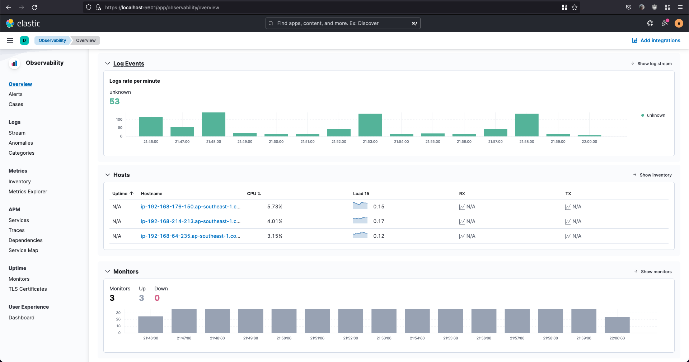

# Elastic Stacks

## Description

This folder is used to try Elastic Stacks using Elastic Cloud on Kubernetes (ECK)

## Steps

1. Create K8s cluster

   ```
   eksctl create cluster -f eks-cluster.yaml
   ```

2. Install Custom Resource Definition

   ```
   kubectl create -f https://download.elastic.co/downloads/eck/2.2.0/crds.yaml
   ```

3. Install Kubernetes Operator

   ```
   kubectl apply -f https://download.elastic.co/downloads/eck/2.2.0/operator.yaml
   ```

4. Deploy Elasticsearch Cluster

   ```
   kubectl apply -f elasticsearch.yaml
   ```

   To retrieve details about Elasticsearch cluster

   ```
   kubectl get elasticsearch
   ```

   To list the pod

   ```
   kubectl get pods --selector='elasticsearch.k8s.elastic.co/cluster-name=quickstart'
   ```

   To get the credentials
   The default username is **elastic**

   ```
   kubectl get secret quickstart-es-elastic-user -o go-template='{{.data.elastic | base64decode}}'
   ```

   To access using port forwarding

   ```
   kubectl port-forward service/quickstart-es-http 9200
   ```

5. Deploy Kibana

   ```
   kubectl apply -f kibana.yaml
   ```

   To retrieve details about Kibana

   ```
   kubectl get kibana
   ```

   To list the pod

   ```
   kubectl get pod --selector='kibana.k8s.elastic.co/name=quickstart'
   ```

   To access using port forwarding

   ```
   kubectl port-forward service/quickstart-kb-http 5601
   ```

   Use the same username and password as Elasticsearch

6. Beat on ECK

   - Filebeat  
     Filebeat with autodiscover required Beat Pods to interact with Kubernetes API. Specific permission are needed to allow this functionality.

     Deploy Filebeat

     ```
     kubectl apply -f filebeat.yaml
     ```

   - Metricbeat  
     Same with Filebeat. Metricbeat required Beat Pods to interact with Kubernetes API. Specific permission are needed to allow this functionality.

     Depoy Metricbeat

     ```
     kubectl apply -f metricbeat.yaml
     ```

   - Heartbeat  
     Deploy Heartbeat

     ```
     kubectl apply -f heartbeat.yaml
     ```

7. Deploy simple service

   ```
   kubectl apply -f ../argocd/manifest
   ```

8. Access Beat on Kibana in Observability menu  
   

## Clean Up

1. Delete simple service

   ```
   kubectl delete -f ../argocd/manifest
   ```

2. Delete all Beat

   ```
   kubectl delete -f heartbeat.yaml
   kubectl delete -f metricbeat.yaml
   kubectl delete -f filebeat.yaml
   ```

3. Delete Kibana & Elasticsearch

   ```
   kubectl delete -f kibana.yaml
   kubectl delete -f elasticsearch.yaml
   ```

4. Delete Operator & Custom Resource Definition

   ```
   kubectl delete -f https://download.elastic.co/downloads/eck/2.2.0/operator.yaml
   kubectl delete -f https://download.elastic.co/downloads/eck/2.2.0/crds.yaml
   ```

5. Delete Kubernetes cluster

   ```
   eksctl delete cluster -f eks-cluster.yaml
   ```

## References

1. https://www.elastic.co/guide/en/cloud-on-k8s/current/k8s-quickstart.html
2. https://www.elastic.co/guide/en/cloud-on-k8s/current/k8s-beat-configuration.html
3. https://github.com/elastic/cloud-on-k8s/tree/2.2/config/recipes/beats
